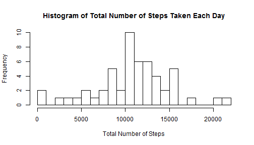
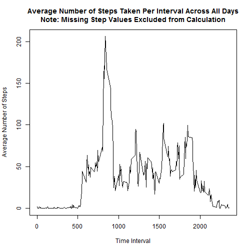
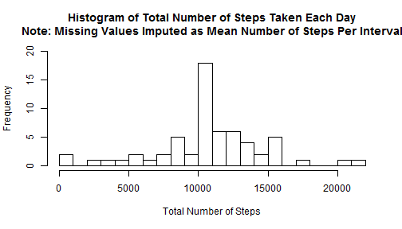
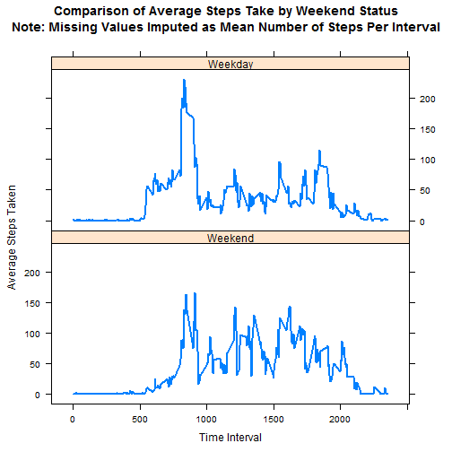

Peer Assessment - Project 1
================================================
## Loading and preprocessing the data

1. Load the data (i.e. read.csv())  

	Set the working directory containing the data, loading the necessary libraries, and reading in the data. 
	Always check the dimensions and print the first few lines to ensure a good read in.

	
	```r
	library(knitr)
	library(plyr)
	library(lattice)
	setwd("~/Training/Data Scientist's Toolbox/RepRes")
	data <- read.csv("activity.csv", header = T)
	```
	
	```
	## Warning: cannot open file 'activity.csv': No such file or directory
	```
	
	```
	## Error: cannot open the connection
	```
	
	```r
	dim(data)
	```
	
	```
	## [1] 17568     3
	```
	
	```r
	head(data)
	```
	
	```
	##   steps       date interval
	## 1    NA 2012-10-01        0
	## 2    NA 2012-10-01        5
	## 3    NA 2012-10-01       10
	## 4    NA 2012-10-01       15
	## 5    NA 2012-10-01       20
	## 6    NA 2012-10-01       25
	```
2. Process/transform the data (if necessary) into a format suitable for your analysis  
 
	Convert the 'date' variable into a date format that R understands

	
	```r
	data$date <- as.Date(data$date, "%Y-%m-%d")
	```

We're ready to start answering the project questions!

## What is mean total number of steps taken per day?  

For this part of the assignment, we can ignore the missing values in the dataset.  
In order to calculate the total number of steps taken per day, we must aggregate the data at the date level.

```r
data1 <- aggregate(steps ~ date, data = data, sum)
```

1. Make a histogram of the total number of steps taken each day
	
	```r
	hist(data1$steps, 20, main="Histogram of Total Number of Steps Taken Each Day", 
	xlab="Total Number of Steps")
	```
	
	 

2. Calculate and report the mean and median total number of steps taken per day  
	The mean total number of steps taken per day is:
	
	```r
	mean(data1$steps)
	```
	
	```
	## [1] 10766
	```
	The median total number of steps taken per day is:
	
	```r
	median(data1$steps)
	```
	
	```
	## [1] 10765
	```

## What is the average daily activity pattern?

1. Make a time series plot (i.e. type = "l") of the 5-minute interval (x-axis) and the average number of steps taken, averaged across all days (y-axis)
	
	```r
	summary(data)
	```
	
	```
	##      steps            date               interval   
	##  Min.   :  0.0   Min.   :2012-10-01   Min.   :   0  
	##  1st Qu.:  0.0   1st Qu.:2012-10-16   1st Qu.: 589  
	##  Median :  0.0   Median :2012-10-31   Median :1178  
	##  Mean   : 37.4   Mean   :2012-10-31   Mean   :1178  
	##  3rd Qu.: 12.0   3rd Qu.:2012-11-15   3rd Qu.:1766  
	##  Max.   :806.0   Max.   :2012-11-30   Max.   :2355  
	##  NA's   :2304
	```
	We see missingness in the "steps" variable and have to remove them before calculating the mean  
	
	```r
	data2 <- na.omit(data)
	```
	From here, we can take the aggregate of the data at the interval level and make our plot   
	
	```r
	data3 <- aggregate(steps ~ interval, data = data2, mean)
	plot(data3$interval, data3$steps, type = "l", xlab="Time Interval", ylab="Average Number of Steps",
	main="Average Number of Steps Taken Per Interval Across All Days
	Note: Missing Step Values Excluded from Calculation")
	```
	
	 
2. Which 5-minute interval, on average across all the days in the dataset, contains the maximum number of steps?  
	The 5-minute interval that contains the maximum number of average steps is:
	
	```r
	data3[which.max(data3$steps),]$interval
	```
	
	```
	## [1] 835
	```

## Imputing missing values  

Note that there are a number of days/intervals where there are missing values (coded as NA). The presence of missing days may introduce bias into some calculations or summaries of the data.

1. Calculate and report the total number of missing values in the dataset (i.e. the total number of rows with NAs)  
	
	```r
	try1 <- summary(data)
	try2 <- gsub(" ","",try1[7], fixed=TRUE)
	try3 <- gsub("NA's:","",try2, fixed=TRUE)
	gsub(" ","",try1[7], fixed=TRUE)
	```
	
	```
	## [1] "NA's:2304"
	```
	The total number of missing values in the dataset is 2304. 

2. Devise a strategy for filling in all of the missing values in the dataset. The strategy does not need to be sophisticated. For example, you could use the mean/median for that day, or the mean for that 5-minute interval, etc.

	We are going to replace the NA's in the 'steps' variable with the average number of steps per interval. This will require using the aggregate data at the interval level and then replacing
	missing values by date and interval. This process will be a combination of 'join' and 'ifelse' statements.  
	
3. Create a new dataset that is equal to the original dataset but with the missing data filled in.  

	First we identified the dates with the missing step values: 
	
	```r
	data5 <- data[which(is.na(data$steps)),]
	```
	Using the aggregate step data from part earlier (data3, we are going to replace the missing values:  
	
	```r
	data6 <- join(data5,data3,by="interval")
	names(data6) <- c("steps1","date","interval","steps2")
	data7 <- join(data, data6, by=c("date", "interval"))
	```
	Next, we create an "complete" step variable called "stepComp" by pulling existing step values and replacing the NA values:  
	
	```r
	data7$stepComp <- ifelse(is.na(data7[,1]),data7[,5],data7[,1])
	```
	Extracting only the variables were are interested in:  
	
	```r
	data8 <- data7[,c("date","interval","stepComp")]
	```
	We have our final dataset with no missing step values!  
	
	```r
	summary(data8)
	```
	
	```
	##       date               interval       stepComp    
	##  Min.   :2012-10-01   Min.   :   0   Min.   :  0.0  
	##  1st Qu.:2012-10-16   1st Qu.: 589   1st Qu.:  0.0  
	##  Median :2012-10-31   Median :1178   Median :  0.0  
	##  Mean   :2012-10-31   Mean   :1178   Mean   : 37.4  
	##  3rd Qu.:2012-11-15   3rd Qu.:1766   3rd Qu.: 27.0  
	##  Max.   :2012-11-30   Max.   :2355   Max.   :806.0
	```
4. Make a histogram of the total number of steps taken each day and Calculate and report the mean and median total number of steps taken per day. 

	First we must recreate the aggregate data at the steps level. Once that is completed, we can use that dataset to create the histogram of interest.  
	
	```r
	data9 <- aggregate(stepComp ~ date, data = data8, sum)
	hist(data9$stepComp, 20, main="Histogram of Total Number of Steps Taken Each Day
	Note: Missing Values Imputed as Mean Number of Steps Per Interval", 
	xlab="Total Number of Steps", ylim=c(0,20))  
	```
	
	 
	
	The new mean total number of steps taken per day for the imputed data is:
	
	```r
	mean(data9$stepComp)
	```
	
	```
	## [1] 10766
	```
	The new median total number of steps taken per day for the imputed data is:
	
	```r
	median(data9$stepComp)
	```
	
	```
	## [1] 10766
	```
	#### Do these values differ from the estimates from the first part of the assignment?   
	Comparing these results to the results we obtained earlier by simply excluding the missing values, we see that the mean value of the data did not change (original: 10766 vs imputed: 10766) but the median
	did slightly increase (original: 10765 vs imputed: 10766).   
	
	#### What is the impact of imputing missing data on the estimates of the total daily number of steps?  
	The impact of imputing our missing values by using the mean of the interval over all days did not change the mean of the data but increased the value of the 75th percentile (original: 12 vs. imputed: 27) and
	increased the frequency of the highest total number of steps taken. Overall, the distribution of the data did not visibly change but different statistics of the data were affected in different magnitudes.  

## Are there differences in activity patterns between weekdays and weekends?  

For this part the weekdays() function may be of some help here. Use the dataset with the filled-in missing values for this part.

1. Create a new factor variable in the dataset with two levels ('weekday' and 'weekend') indicating whether a given date is a weekday or weekend day.

	First we must create a variable that indicates the day the date falls on. Next, we create another variable indicating weekend or weekday status (1 vs 2 respectively). We transform
	this variable into a factor variable that we will later use for plotting our data. Always check created variables for accuracy! 

	
	```r
	data10 <- data8
	data10$date <- as.Date(data10$date, "%Y-%m-%d")
	data10$weekday <- weekdays(data10$date)
	data10$wdfactor <- ifelse(data10$weekday=="Saturday"|data10$weekday=="Sunday", 1, 2)
	data10$wdfactor <- factor(data10$wdfactor, levels=c(1,2), labels=c("Weekend","Weekday"))
	table(data10$weekday, data10$wdfactor)
	```
	
	```
	##            
	##             Weekend Weekday
	##   Friday          0    2592
	##   Monday          0    2592
	##   Saturday     2304       0
	##   Sunday       2304       0
	##   Thursday        0    2592
	##   Tuesday         0    2592
	##   Wednesday       0    2592
	```

2. Make a panel plot containing a time series plot (i.e. type = "l") of the 5-minute interval (x-axis) and the average number of steps taken, averaged across all weekday days or weekend days (y-axis). 

	Using the data we created above, we can create a comparison plot for activity factored by weekend status.  
	
	
	```r
	data11 <- aggregate(stepComp ~ wdfactor+interval, data = data10, mean)
	xyplot(data11$stepComp ~ data11$interval | data11$wdfactor, layout =c(1,2), type='l', lwd=2, 
	main="Comparison of Average Steps Take by Weekend Status
	Note: Missing Values Imputed as Mean Number of Steps Per Interval", 
	xlab="Time Interval", ylab="Average Steps Taken")
	```
	
	 
